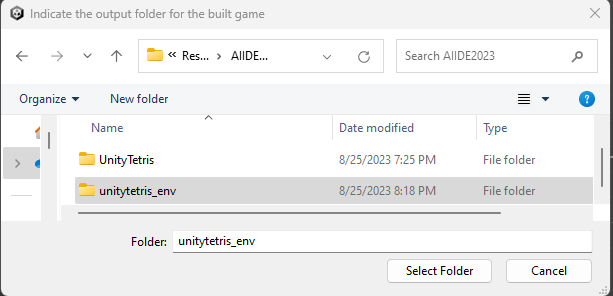

# Overview
This repository provides a prototype implementation for the Unity game engine of the approach for analyzing game actions described in _Automatically Defining Game Action Spaces for Exploration Using Program Analysis_ (AIIDE-23). The code and instructions in this repository provide everything needed to set up Random and reinforcement learning (DQN) agents for automatically exploring a given game using our automated analysis to define the action spaces of the environments. The instructions also explain how to measure the various metrics used in the paper (including state coverage, code coverage, run time, and action counts).

# Capabilities and Limitations
- This tool will analyze any key, button, axis, and mouse inputs handled in the game logic via Unity's Input API, generating a discrete action space for the game. The provided Random and DQN agents then automatically explore the game by determining and generating relevant inputs determined by the analysis.
- The new Input System APIs are _not_ supported (only the original `UnityEngine.Input` API)
- This tool does not analyze Unity UI system components. An initialization script should be defined to traverse through any menus to the initial point of gameplay (see [Defining New Environments](#defining_new_envs)).
- Neither inputs handled inside of coroutines, nor those handled in assemblies other than the main assembly (Assembly-CSharp.dll) are supported

# Games
The following publicly available GitHub games were used in experiments with this tool. Example environment code for these games can be found in the `Examples` folder.
* GH1: [science-mario](https://github.com/lucasnfe/science-mario) 
* GH2: [SMB-clone](https://github.com/linhdvu14/SMB-clone)
* GH3: [Pacman](https://github.com/vilbeyli/Pacman)
* GH4: [UnityTetris](https://github.com/Mukarillo/UnityTetris)
* GH5: [2048-unity](https://github.com/jamiltron/2048-unity)
* GH6: [Fruit-Ninja-Replica](https://github.com/Mohammed-Benotmane/Fruit-Ninja-Replica)
* GH7: [bubble-shooter-unity3d](https://github.com/javierquevedo/bubble-shooter-unity3d)
* GH8: [AngryBirds](https://github.com/sarveshchavan7/AngryBirds)

# Instruction Video
The following video explains and demonstrates how to use the tool. You can also follow the written [Step By Step Instructions](#step_by_step) below.

[](https://www.youtube.com/watch?v=4iMjxrLKjYs)

# Step By Step Instructions
<a name="step_by_step">

The following instructions will guide you in getting Random and DQN exploration agents running for a Unity game using our analysis tool for defining the actions. We will use [UnityTetris](https://github.com/Mukarillo/UnityTetris) as the running example.

We have tested the code on 64-bit Linux (Ubuntu 22.04.3) and Windows 11. Other platforms are not supported.

1. Install required software:
* [Unity](https://unity.com/download) (2021.3.18f1 or higher)
* [.NET 6.0](https://dotnet.microsoft.com/en-us/download)
* [Python 3](https://www.python.org/downloads/) (3.7 or higher)

2. Clone this repository and the repository of the target game:
```
git clone https://github.com/USC-SQL/AutoGym
git clone https://github.com/Mukarillo/UnityTetris
```

3. Create a Python virtual environment and install required packages:
```
cd AutoGym
python -m venv venv
source venv/bin/activate # on Windows use: venv\Scripts\activate.bat
python -m pip install -r requirements.txt
```  

4. From within the ActionAnalysis folder, run: `dotnet build`.
```
cd ActionAnalysis
dotnet build
```

Note the location of the build directory (bolded in the example build output below):
<pre>
MSBuild version 17.3.0+92e077650 for .NET
  Determining projects to restore...
  All projects are up-to-date for restore.
  UnityActionAnalysisTestCases -> C:\Users\sasha-usc\Documents\Research\AIIDE2023\AutoGym\ActionAnalysis\UnityActionAnalysisTestCases\bin\x64\Debug\net6.0\UnityActionAnalysisTestCases.dll
  UnityActionAnalysis -> <b>C:\Users\sasha-usc\Documents\Research\AIIDE2023\AutoGym\ActionAnalysis\UnityActionAnalysis\bin\x64\Debug\net6.0\</b>UnityActionAnalysis.dll
  UnityActionAnalysisTests -> C:\Users\sasha-usc\Documents\Research\AIIDE2023\AutoGym\ActionAnalysis\UnityActionAnalysisTests\bin\x64\Debug\net6.0\UnityActionAnalysisTests.dll
</pre>

5. Copy (or symlink) the `AutoGymScripts` folder into the Assets folder of the game (either on command-line or with a GUI file manager).
```
cp -r AutoGymScripts ../UnityTetris/Assets
```

6. Copy the environment code for UnityTetris in `Examples/UnityTetrisEnv` into the Assets folder of the game. This code defines the initialization steps (if any) and done condition for the game. Please see the section [Defining New Environments](#defining_new_envs) for instructions on how to create this code for games not included in our examples.
```
cp -r Examples/UnityTetrisEnv ../UnityTetris/Assets
```

6. Open the game in Unity (for UnityTetris, it is OK for Unity to update the project files if needed). Note that it is OK if you encounter a script compile error here, this will be addressed in the next step.

7. Install the Newtonsoft.Json package through Unity's package manager:

Go to Window -> Package Manager. Click the plus sign, then "Add package by name..." and add "com.unity.nuget.newtonsoft-json".


If there are any remaining script compile errors, add the "com.unity.ugui" package as well.

8. Open the first scene of the game (scene "Main" for UnityTetris).


Create a new game object in the root of the scene (in our example we will create one named "GameEnv"), and add the environment script component (in our example, `UnityTetrisEnv`). Save the scene after making this change.


9. Go to File -> Build Settings, and press the "Add Open Scenes" button. This will configure the game build.


10. Go to the AutoGym -> Configure menu.
 


Select the location of `UnityActionAnalysis` (or `UnityActionAnalysis.exe` on Windows) in the build directory noted in step 4.


11. Go to the AutoGym -> Build Gym Environment menu. This will prompt you to select a folder where the built game will be saved. We will create a folder named "unitytetris_env" and select it.



12. The Console will now display the progress of the action analysis. When the analysis, build, and instrumentation is complete a dialog will pop up with the message "Environment build successful."


13. In the build folder, there are now two configuration files generated (one for Random, `unitytetris_env_random_aa.json`, and one for DQN, `unitytetris_env_dqn_s84x4_count_aa.json`).
From the AutoGym repository, the following command can now be issued to start a Random agent:
```
# make sure the virtual environment is activated
source venv/bin/activate # on Windows use: venv\Scripts\activate.bat

# run the random agent
python run.py unitytetris_env/unitytetris_env_random_aa.json
```

This will cause the game to open and the random agent to begin interacting with the game, simulating relevant inputs on the game determined by the action analysis. On Windows, make sure to press the "Allow" button on the firewall pop-up to ensure the agent code can communicate with the game process.


To run the DQN agent, use the `unitytetris_env_dqn_s84x4_count_aa.json` configuration file instead. This will run a curiosity-driven reinforcement learning agent that takes game screenshots as input and learns over time to prioritize actions leading to new states.

# Taking Measurements
As the agents run, they populate SQLite databases with a variety of information about the game exploration. These can be found in the `info` folder of the built environment folder (e.g. `unitytetris_env/info/unitytetris_env_random_aa.db`). You must have the [sqlite3](https://www.sqlite.org/index.html) tool installed on your system to view this data. The following sections explain how to measure the various metrics used in the paper.

## State Coverage

The following query will calculate the number of distinct states visited (according to the state hashing methodology described in the paper).
```
sqlite3 unitytetris_env_random_aa.db "select count(distinct state_hash) from states_unitytetris_env_random_aa"
```

## Code Coverage

To measure code coverage, first run the following command to install version 8.5.841 of the AltCover code coverage measurement tool:
```
dotnet tool install --global altcover.global --version 8.5.841
```

Next, you will need to build the game environment with code coverage enabled. At step 11 of the instructions, instead run AutoGym -> Build Gym Environment (with Code Coverage).


A dialog will pop up prompting you to indicate the path of the altcover executable. This can typically be found at `C:\Users\<user>\.dotnet\tools\altcover.exe` on Windows, and `/home/<user>/.dotnet/tools/altcover` on Linux. Follow the rest of the instructions as usual to run the random or DQN agents.

The database will now be populated with the code points that have been visited. The total number of visited code points can be calculated with the following command:
```
sqlite3 unitytetris_env_random_aa.db "select count(seqpt_id) from codecov_unitytetris_env_random_aa"
```

To calculate the coverage percentage, divide this number by the total number of code points, which can be calculated with the following command (using [jq](https://jqlang.github.io/jq/)):
```
jq "[.. | .SeqPnts? | arrays | length] | add" unitytetris_env/build/coverage.json
```

## Run Times

The average time to determine valid actions per step can be calculated with the following command:
```
sqlite3 unitytetris_env_random_aa.db "select avg(time_valid_actions) from time_va_unitytetris_env_random_aa"
```
The average time to perform a chosen action per step can be calculated with the following command:
```
sqlite3 unitytetris_env_random_aa.db "select avg(time_perform_action) from time_pa_unitytetris_env_random_aa"
```

## Action Counts

The size of the discrete action space computed by the analysis can be found under `env_config.num_actions` in the JSON configuration file, e.g. `unitytetris_env_random_aa.json`. Note that the number of actions may be affected by the platform or compiler, since the analysis is performed on the compiled game assembly.

## Action Validity Functions

The functions generated by the analysis for testing action validity will be generated into the `Assets` folder of the game in a source file named `PreconditionFuncs.cs`. You can view this file to see the functions generated for determining the validity of each action under the current game state. The comment above each function gives the full path condition that it is associated with.

## Comparing Against Manual and Blind Action Spaces

In the paper we compare against two other approaches to defining the actions: _Manual_ (representing manually annotated actions per game) and _Blind_ (a generic action space comprised of all common keyboard and mouse actions). We have provided the implementations of both of these, activating them requires copying and adjusting the generated configuration file.

To activate Manual, copy the JSON configuration file, then delete the line `"symex_actions": true`, and replace it with `"manual_actions": true`. Be sure to do a find/replace operation to rename all outputs (e.g. replace `unitytetris_env_random_aa` with `unitytetris_env_random_manual`).
```
cp unitytetris_env/unitytetris_env_random_aa.json unitytetris_env/unitytetris_env_random_manual.json
[modify unitytetris_env_random_manual.json as indicated]
```

Next, invoke `run.py` with this new configuration file. You will initially get an error indicating an action space size mismatch.
```
python run.py unitytetris_env/unitytetris_env_random_manual.json
...
Exception: action space size in configuration (600) does not match game client (7)
...
```

Modify the configuration file again, adjusting `num_actions` to the number given in the error message (in this example 7). You are now done, and can invoke `run.py` with this configuration to measure results with the Manual action space.

To activate Blind, follow the same process, except instead use `"blind_actions": true`.

# Defining New Environments
<a name="defining_new_envs">

In order to use this tool with games not in our examples, an environment script should be defined that implements the methods `EnterInitialState()`, which traverses any initial menus to the initial point of gameplay, and `IsDone()`, which defines when an episode of the agent's exploration should be ended (for example, a game over screen). Examples of these scripts are available in the `Examples` folder.

The script should have the following structure:
```
namespace UnityRLEnv
{

public class MyGameEnv : ScreenshotRLEnv
{
  protected override IEnumerator EnterInitialState()
  {
    // Example script to press the "Play" button and wait until the character appears
    Button btn = GameObject.Find("Play").GetComponent<Button>();
    ExecuteEvents.Execute(btn.gameObject, new PointerEventData(EventSystem.current), ExecuteEvents.submitHandler);
    while (GameObject.Find("player") == null)
      yield return null;
  }

  protected override bool IsDone()
  {
     // Example of done condition that triggers when game over appears
     return GameObject.Find("GameOver") != null;
  }
}

}
```

This script now just needs be added as a component to a game object as in Step 8 of the instructions, and the agents will be able to interact with the game. 

Note that the `ManualActionProvider` scripts in our examples are not required, these were used to define the manual action spaces compared against in our paper's experiments. The environment will default to using the actions provided by our analysis. It is also possible to blacklist certain undesirable actions (such as Pause/Quit), see the `PacmanEnv` and `SMBCloneEnv` examples for how to do this.

# Running Tests
Run action analysis tool unit tests:
```
cd ActionAnalysis
dotnet test
```

Run CartPole test with DQN implementation:
```
python -m unittest tests.test_dqn
```

# Experiment Data

CSV files of the paper's experiment data have been provided in the [doc/data directory](https://github.com/USC-SQL/AutoGym/tree/main/doc/data).

# Citation

```
@InProceedings{volokh23aiide,
  Title                    = {Automatically Defining Game Action Spaces for Exploration Using Program Analysis},
  Author                   = {Sasha Volokh and William G.J. Halfond},
  Booktitle                = {Proceedings of the Nineteenth {AAAI} Conference on Artificial Intelligence and Interactive Digital Entertainment (AIIDE-23)},
  Year                     = {2023},
  Month                    = {October},
  Keywords                 = {exploration, game testing, program analysis, reinforcement learning},
  Pubtype                  = {Conference}
}
```
